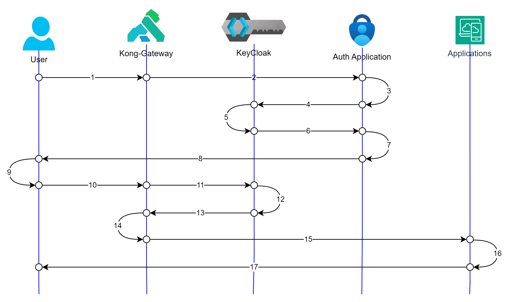

# Gatekeeper

Gatekeeper is meant to guard the applications from Unauthorized and Unauthenticated accesses. Here we will try to use a combination of Kong + Keycloak + Auth (app) to achieve the same. Also, we are not planning to use KeyCloak's UI for application login, thus we are aiming for Auth application to build and provide the required validation/authorization channels with KeyCloak.

Below is the schematic representation of the work-flow

### _steps_
1. User initiates a login requests to Auth App (/auth/login/{clientId}), but the route reaches Kong gateway.
2. Kong gateway re-routes the request to Auth App.
3. Auth App validates the message.
4. Auth App forwards the requests to Keycloak with clientId & client-secret.
5. KeyCloak validates the credentials and generates access token, id token, expiry, etc.
6. KeyCloak forwards the details to Auth App.
7. Auth App receives the response from KeyCloak.
8. Auth App relays the response to the User.
9. User application may decide to store the token, expiry, refresh-token into their local-storage or session.
10. User initiates another API but this time with access token in header. Kong receives the request.
11. Kong initiates token introspection with KeyCloak using OIDC plugin. This step will ensure if the token is invalidated by KeyCloak, it will not allow the API to proceed.
12. KeyCloak will check the validity of token.
13. Kong receives response from Keycloak.
14. Kong initiates validity of RBAC using JWT plugin.
15. On success, request is forwarded to Business Application.
16. Business Application processes the request.
17. Business Application sends the response to the User.

# Components

## [Postgres](./postgres/postgres.md)
DB is a must for every component of the Gatekeeper.
Choice of DB can be independent for each of the component, but is required. We are choosing postgres for it being freely available compatible to each of the component.

__version__ : 9.5

## KeyCloak
Details of KeyCloak are availble [here](./keycloak/KeyCloak.md).

## Kong
Details of Kong are available [here](./kong/Kong.md).

# Gatekeeper setup steps
- Start / Create PG Database [link](./postgres/postgres.md)
- Create DB for KeyCloak and provide its configuration in [Keycloak's env](./keycloak/keycloak_env.list)
- Create DB for Kong and provide its configuration in [Kong's env](./kong/kong_env.list)
- Start Keycloak. Starting it for the 1st time, we will have to give it sometime to bootstrap. It will internally run the migrations and create the required tables.
- [Build](./kong/Kong.md#build) customized Kong image.
- [Bootstrap](./kong/Kong.md#bootstrap) Kong
- Create Kong routes for KeyCloak, Auth Application and general application. [link](./kong/Kong.md#kong-routing)
- Configure Keycloak with realms, client, custom attribute, realm-roles and users. [link](./keycloak/KeyCloak.md#configuring-keycloak)
- Try login using the Auth Login API. [link](./auth/Auth.md#login-route-authloginkeycloakclientid)
- Build, deploy and test the Dummy App which exposes an API [link](./app/App.md) & test the dummy API with token [link](./app/App.md#before-securing-the-api)
- Secure the API using Kong OIDC plugin and JWT plugin. [link](./kong/Kong.md#securing-apis)
