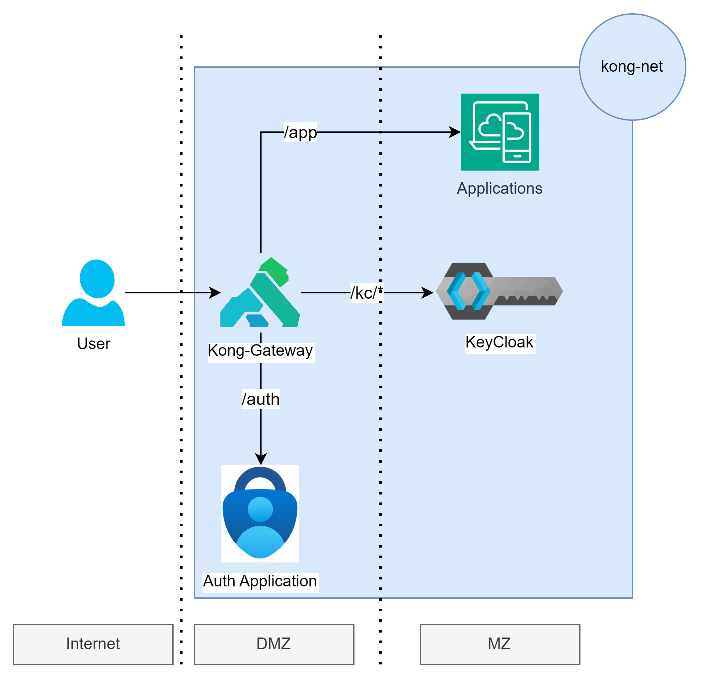
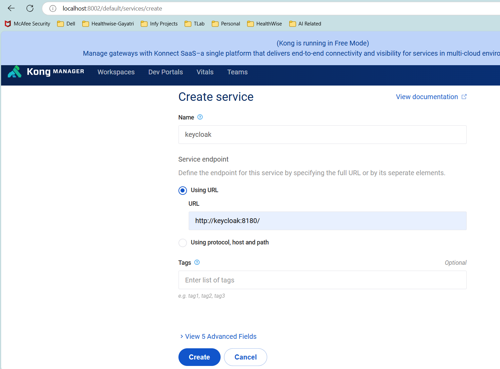
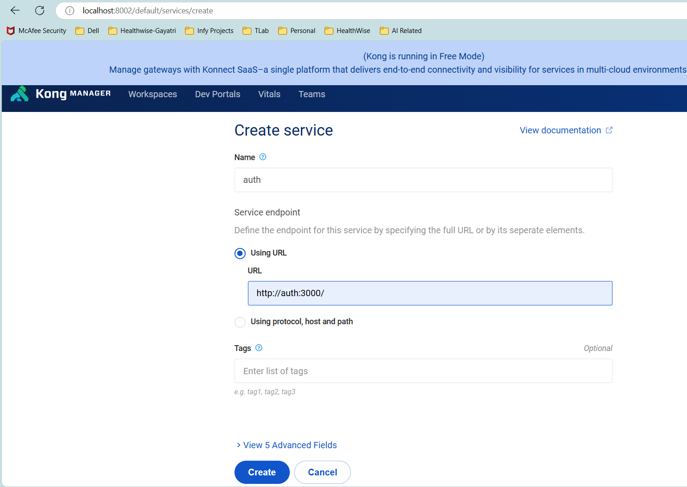
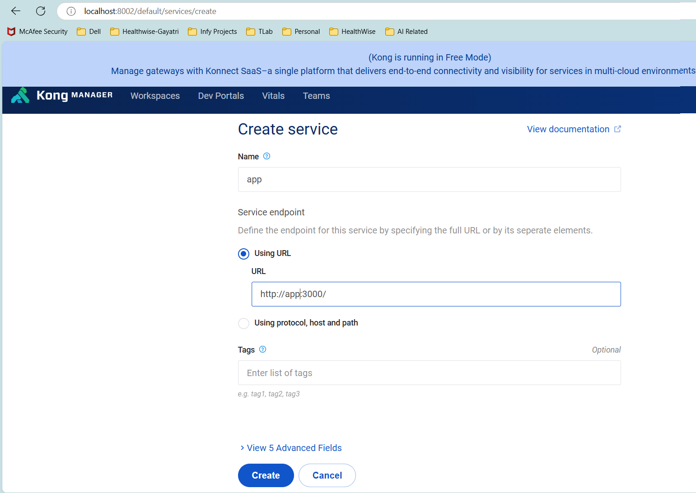

# Kong

This is a custom Kong setup. It is based on Kong-gateway 3.1 (community edition).
The custom kong will have OIDC plugin and JWT plugin.
These plugins help in centralising and controlling access management for APIs.

# Cust OIDC Plugin
The OIDC plugin is based on [Nokia/Kong-oidc](https://github.com/nokia/kong-oidc).

This OIDC plugin was not compatible directly with the Kong version and hence we had to implement te same in our custom Kong.
### Parameters

| Parameter | Default  | Required | description |
| --- | --- | --- | --- |
| `name` || true | plugin name, has to be `oidc` |
| `config.client_id` || true | OIDC Client ID |
| `config.client_secret` || true | OIDC Client secret |
| `config.discovery` | https://.well-known/openid-configuration | false | OIDC Discovery Endpoint (`/.well-known/openid-configuration`) |
| `config.scope` | openid | false| OAuth2 Token scope. To use OIDC it has to contains the `openid` scope |
| `config.ssl_verify` | false | false | Enable SSL verification to OIDC Provider |
| `config.session_secret` | | false | Additional parameter, which is used to encrypt the session cookie. Needs to be random |
| `config.introspection_endpoint` | | false | Token introspection endpoint |
| `config.timeout` | | false | OIDC endpoint calls timeout |
| `config.introspection_endpoint_auth_method` | client_secret_basic | false | Token introspection auth method. resty-openidc supports `client_secret_(basic|post)` |
| `config.bearer_only` | no | false | Only introspect tokens without redirecting |
| `config.realm` | kong | false | Realm used in WWW-Authenticate response header |
| `config.logout_path` | /logout | false | Absolute path used to logout from the OIDC RP |


# Cust JWT Plugin
The JWT plugin is based on [Kong Plugin JWT KeyCloak](https://github.com/sezane/kong-plugin-jwt-keycloak-v2/tree/master)

This Kong Plugin JWT Keycloak was not compatible directly with Kong version and hence we had to implement the same in our custom Kong.
### Parameters

| Parameter                              | Requied | Default           | Description                                                                                                                                                                                                                                                                                                                                                                              |
| -------------------------------------- | ------- | ----------------- | ---------------------------------------------------------------------------------------------------------------------------------------------------------------------------------------------------------------------------------------------------------------------------------------------------------------------------------------------------------------------------------------- |
| name                                   | yes     |                   | The name of the plugin to use, in this case `keycloak-jwt`.                                                                                                                                                                                                                                                                                                                              |
| service_id                             | semi    |                   | The id of the Service which this plugin will target.                                                                                                                                                                                                                                                                                                                                     |
| route_id                               | semi    |                   | The id of the Route which this plugin will target.                                                                                                                                                                                                                                                                                                                                       |
| enabled                                | no      | `true`            | Whether this plugin will be applied.                                                                                                                                                                                                                                                                                                                                                     |
| config.uri_param_names                 | no      | `jwt`             | A list of querystring parameters that Kong will inspect to retrieve JWTs.                                                                                                                                                                                                                                                                                                                |
| config.cookie_names                    | no      |                   | A list of cookie names that Kong will inspect to retrieve JWTs.                                                                                                                                                                                                                                                                                                                          |
| config.claims_to_verify                | no      | `exp`             | A list of registered claims (according to [RFC 7519](https://tools.ietf.org/html/rfc7519)) that Kong can verify as well. Accepted values: `exp`, `nbf`.                                                                                                                                                                                                                                  |
| config.anonymous                       | no      |                   | An optional string (consumer uuid) value to use as an “anonymous” consumer if authentication fails. If empty (default), the request will fail with an authentication failure `4xx`. Please note that this value must refer to the Consumer `id` attribute which is internal to Kong, and not its `custom_id`.                                                                            |
| config.run_on_preflight                | no      | `true`            | A boolean value that indicates whether the plugin should run (and try to authenticate) on `OPTIONS` preflight requests, if set to false then `OPTIONS` requests will always be allowed.                                                                                                                                                                                                  |
| config.header_names                    | no      | `authorization`   | A list of HTTP header names that Kong will inspect to retrieve JWTs. `OPTIONS` requests will always be allowed.                                                                                                                                                                                                  |
| config.maximum_expiration              | no      | `0`               | An integer limiting the lifetime of the JWT to `maximum_expiration` seconds in the future. Any JWT that has a longer lifetime will rejected (HTTP 403). If this value is specified, `exp` must be specified as well in the `claims_to_verify` property. The default value of `0` represents an indefinite period. Potential clock skew should be considered when configuring this value. |
| config.algorithm                       | no      | `RS256`           | The algorithm used to verify the token’s signature. Can be `HS256`, `HS384`, `HS512`, `RS256`, or `ES256`.                                                                                                                                                                                                                                                                               |
| config.allowed_iss                     | yes     |                   | A list of allowed issuers for this route/service/api. Can be specified as a `string` or as a [Pattern](http://lua-users.org/wiki/PatternsTutorial).                                                                                                                                                                                                                                      |
| config.iss_key_grace_period            | no      | `10`              | An integer that sets the number of seconds until public keys for an issuer can be updated after writing new keys to the cache. This is a guard so that the Kong cache will not invalidate every time a token signed with an invalid public key is sent to the plugin.                                                                                                                    |
| config.well_known_template             | false   | *see description* | A string template that the well known endpoint for keycloak is created from. String formatting is applied on the template and `%s` is replaced by the issuer of the token. Default value is `%s/.well-known/openid-configuration`                                                                                                                                                        |
| config.scope                           | no      |                   | A list of scopes the token must have to access the api, i.e. `["email"]`. The token only has to have one of the listed scopes to be authorized.                                                                                                                                                                                                                                          |
| config.roles                           | no      |                   | A list of roles of current client the token must have to access the api, i.e. `["uma_protection"]`. The token only has to have one of the listed roles to be authorized.                                                                                                                                                                                                                 |
| config.realm_roles                     | no      |                   | A list of realm roles (`realm_access`) the token must have to access the api, i.e. `["offline_access"]`. The token only has to have one of the listed roles to be authorized.                                                                                                                                                                                                            |
| config.client_roles                    | no      |                   | A list of roles of a different client (`resource_access`) the token must have to access the api, i.e. `["account:manage-account"]`. The format for each entry should be `<CLIENT_NAME>:<ROLE_NAME>`. The token only has to have one of the listed roles to be authorized.                                                                                                                |
| config.consumer_match                  | no      | `false`           | A boolean value that indicates if the plugin should find a kong consumer with `id`/`custom_id` that equals the `consumer_match_claim` claim in the access token.                                                                                                                                                                                                                         |
| config.consumer_match_claim            | no      | `azp`             | The claim name in the token that the plugin will try to match the kong `id`/`custom_id` against.                                                                                                                                                                                                                                                                                         |
| config.consumer_match_claim_custom_id  | no      | `false`           | A boolean value that indicates if the plugin should match the `consumer_match_claim` claim against the consumers `id` or `custom_id`. By default it matches the consumer against the `id`.                                                                                                                                                                                               |
| config.consumer_match_ignore_not_found | no      | `false`           | A boolean value that indicates if the request should be let through regardless if the plugin is able to match the request to a kong consumer or not.                                                                                                                                                                                                                                     |


Environment Variables
-----------------------------
These are to be set in the [env file](./kong_env.list)

Sr.no | Name|Desc
------|-----|------------------
1|KONG_DATABASE| Type of database. postgres in our case
2|KONG_PG_DATABASE| Name of the database
3|KONG_PG_HOST| IP or Host where the DB service is running.
4|KONG_PG_USER| DB User
5|KONG_PG_PASSWORD| DB User's password
6|KONG_ADMIN_GUI_URL| URL & Port where the Admin portal will be available
7|KONG_LOG_LEVEL| Optional, use debug only if you have to see Kong detail logs. 

# Build
The below command will create a custom image of Kong.

```
sh build-cust-kong.sh
```

# Bootstrap
For Kong to run efficiently, it needs to be seeded. This step ensures all the relevant tables are created and seeded in DB

```
sh bootstrap-kong.sh
```

# Start Kong
Start Kong using the newly created custom image.
```
sh start-kong.sh
```

## Validation of plugins being installed.
Use the below curl command to check the plugins installed in the custom Kong.
```
curl --location 'http://localhost:8001'
```
In the response json that you receive you must be able to see mention of both our custom plugins.
```
        "plugins": [
            "bundled",
            "cust-oidc",
            "cust-jwt"
        ]
```
Both the plugins will be enabled as well.

### Kong Routing



We will be using Kong-Managere (running on port 8002 in the current setup), to setup the routings.
### Steps
- Create 3 services viz. app, auth & keycloak. Parameters as
    - KeyCloak Service 
    - Auth Service 
    - App Service 
- For each of the services created in the above steps add routes
    - Keycloak Route --> NOTE: strip_path is set as false, as KeyCloak is also running with context-path
    ```
    curl --location 'http://localhost:8001/default/services/keycloak/routes' \
    --header 'Content-Type: application/json' \
    --data '{
        "name": "admin-route",
        "protocols": [ "http","https"],
        "paths": ["/kc"],
        "strip_path": false,
        "path_handling": "v1"
    }'
    ```

    - Auth Route --> 

    ```
    curl --location 'http://localhost:8001/default/services/auth/routes' \
    --header 'Content-Type: application/json' \
    --data '{
        "name": "auth-routes",
        "protocols": [ "http","https"],
        "paths": ["/auth"],
        "strip_path": false,
        "path_handling": "v1"
    }'
    ```
    - App Route -->
    ```
    curl --location 'http://localhost:8001/default/services/app/routes' \
    --header 'Content-Type: application/json' \
    --data '{
        "name": "app-routes",
        "protocols": [ "http","https"],
        "paths": ["/app"],
        "strip_path": false,
        "path_handling": "v1"
    }'
    ```
Assuming 8000 is the port which Kong is listening on; try url `http:\\localhost:8000\kc`, it should reroute you to KeyCloak page. If it happens your routing logic is working fine. :) 
